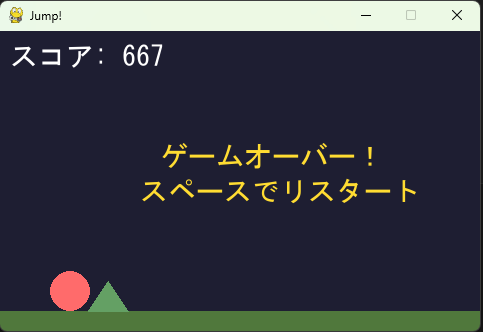

# Jump Game

小学4年生がコーディングを学ぶための**写経教材**です。
コードを自分の手で打ち込み、実際に動くゲームを完成させることでプログラミングの楽しさを体験します。

ゲームの内容は、スペースキーでジャンプして迫りくる山をよけ続けるシンプルなものです。



---

## 遊び方

| 操作 | 動作 |
|:----:|:-----|
| スペースキー | ジャンプ |
| スペースキー | リスタート（ゲームオーバー時） |

- スコアが上がるにつれて山のスピードが速くなります
- 山に当たるとゲームオーバー！

---

## Pythonで実行する

### 1. Python のインストール

[https://www.python.org/downloads/release/python-3120/](https://www.python.org/downloads/release/python-3120/) から **Python 3.12** をダウンロードしてインストールします。

> **注意：** Python 3.13以降は pygame が正しく動作しない場合があります。必ず **3.12** を使ってください。
>
> インストール時に **「Add Python to PATH」にチェック** を入れてください。

### 2. pygame のインストール

コマンドプロンプト（またはターミナル）で次を実行します。

```
pip install pygame
```

### 3. ゲームの実行

このリポジトリをダウンロードし、フォルダ内で次を実行します。

```
python jump_game.py
```

---

## ファイル構成

| ファイル | 説明 |
|:---------|:-----|
| `jump_game.py` | ゲーム本体（写経するファイル） |
| `jump_game_textbook.md` | プログラムの解説テキスト |
| `image.png` | ゲーム画面のスクリーンショット |

---

## 動作環境

- Python **3.12**（3.13以降は pygame との互換性の問題で動作しない場合があります）
- pygame 2.x

---

## ライセンス

MIT License

---

## おまけ：ブラウザで動作イメージを確認する

> **注意：** これは教材ではありません。写経を始める前にゲームの雰囲気をつかむための参考用です。

`jump_game_web.html` をダウンロードしてブラウザで開くと、インストールなしでゲームを体験できます。
スマートフォンのタップにも対応しています。

**→ [ブラウザ版で遊ぶ](https://camelrush.github.io/jump_game/jump_game_web.html)**
